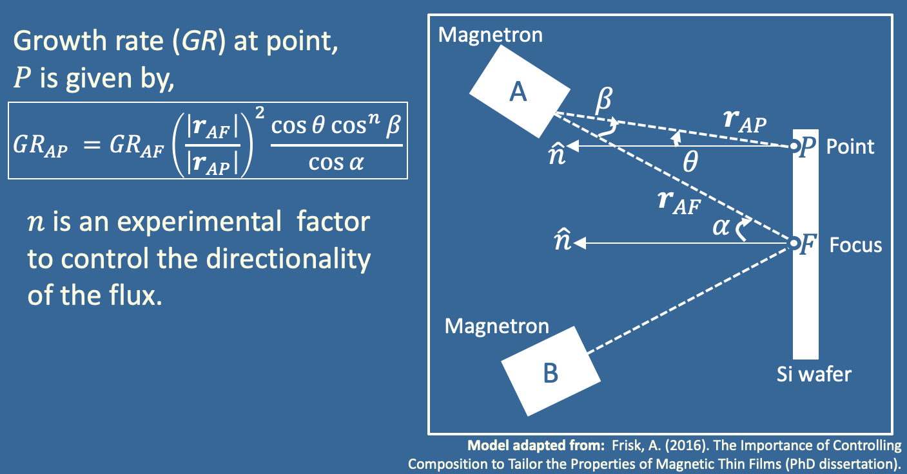

# Combinatorial-Sputtering
Python code to calculate the spatially dependent composition profile of co-sputtered alloys deposited on a substrate

- In the script, the vector is obtained by the vector addition, where r_AP = r_AF + r_FP. 
- r_FP is a vector along the surface of the substrate between the magnetron focus point and the point where we want to calculate the deposition rate.
- The angles alpha and theta are obtained using the dot product of r_AF and r_AP with a unit normal vector, respectively
- The angle beta is the angle between r_AF and r_AP
- This process is completed for all 3 magnetron sources in our sputtering system: A, B and C.

Requirements:
Python 3,
Matplotlib,
Numpy
